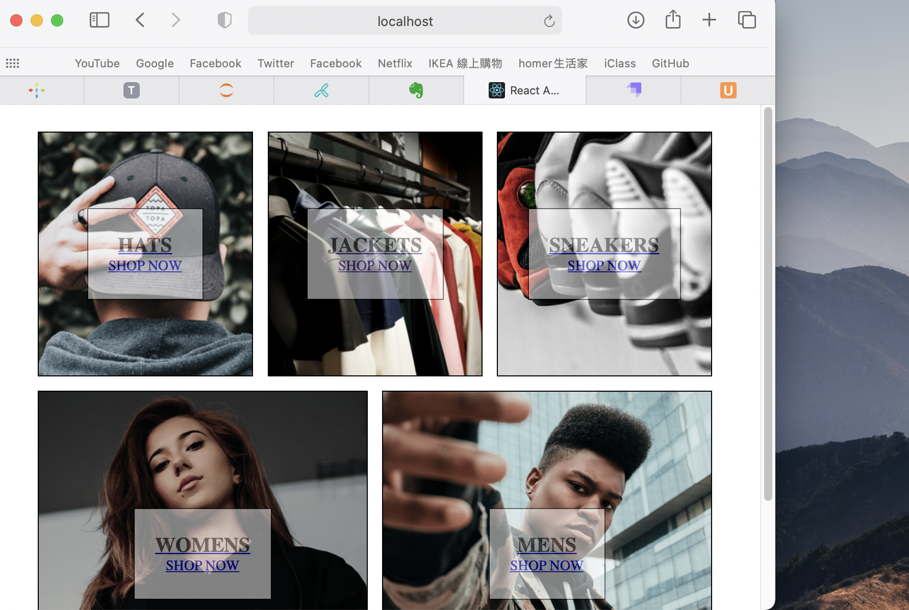
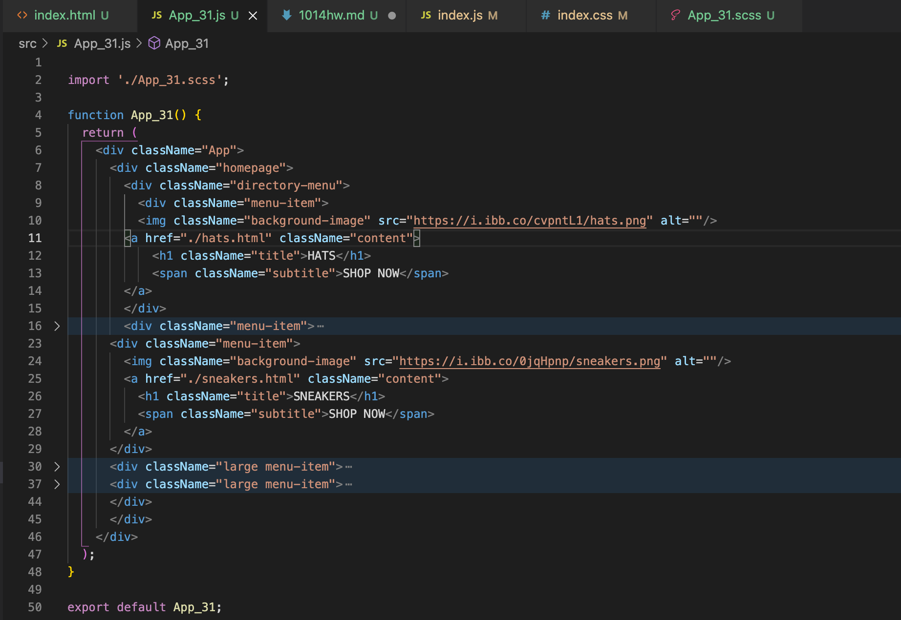
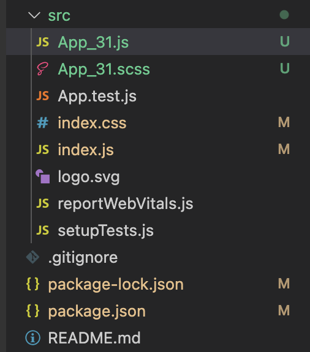
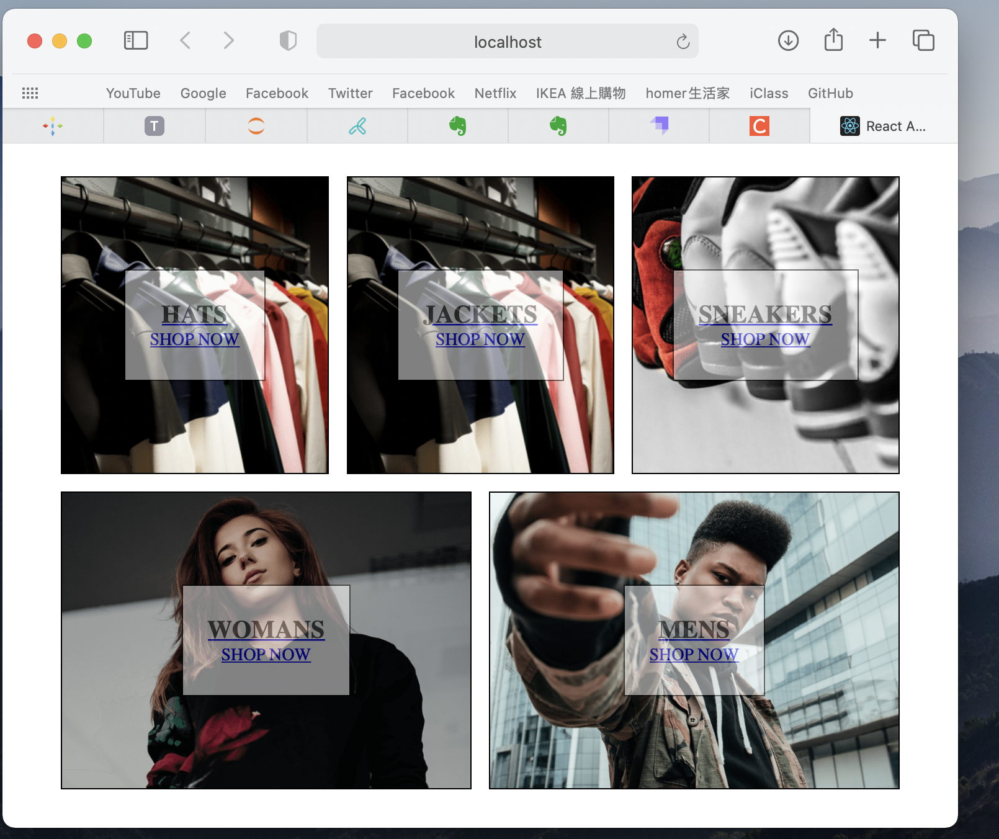
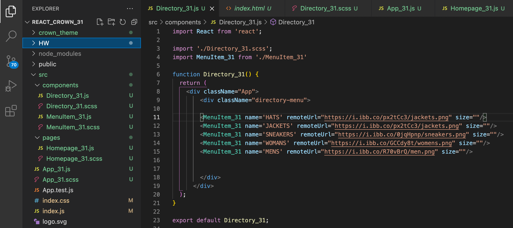
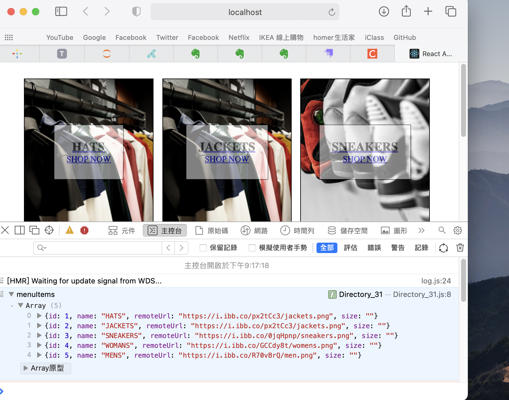

## 1014_HW

0. **心得**

> 重修之後好像有比較了解整個的感覺，但還是有些吃力，但的確是之前太混了哈哈，希望這學期能真的學到點什麼東西，至少要把期中期末 project 做完 QQ

---

1.

- 網頁截圖



- 目錄結構及 App_xx 部分內容截圖




- code

**_App_31_**

```js
import './App_31.scss';

function App_31() {
  return (
    <div className="App">
      <div className="homepage">
        <div className="directory-menu">
          <div className="menu-item">
            
            <a href="./hats.html" className="content">
              <h1 className="title">HATS</h1>
              <span className="subtitle">SHOP NOW</span>
            </a>
          </div>
          <div className="menu-item">
            
            <a href="./jackets.html" className="content">
              <h1 className="title">JACKETS</h1>
              <span className="subtitle">SHOP NOW</span>
            </a>
          </div>
          <div className="menu-item">
            
            <a href="./sneakers.html" className="content">
              <h1 className="title">SNEAKERS</h1>
              <span className="subtitle">SHOP NOW</span>
            </a>
          </div>
          <div className="large menu-item">
            
            <a href="./womens.html" className="content">
              <h1 className="title">WOMENS</h1>
              <span className="subtitle">SHOP NOW</span>
            </a>
          </div>
          <div className="large menu-item">
            
            <a href="./mens.html" className="content">
              <h1 className="title">MENS</h1>
              <span className="subtitle">SHOP NOW</span>
            </a>
          </div>
        </div>
      </div>
    </div>
  );
}

export default App_31;
```

---

2.

- 網頁截圖
  

- 目錄結構
  

- code
  **_Homepages_31.js_**

```js
import React from 'react';
import Directory_31 from '../components/Directory_31';

const Homepage_31 = () => {
  return (
    <div className="homepage">
      <Directory_31 />
    </div>
  );
};

export default Homepage_31;
```

**_Directory_31.js_**

```js
import React, { useState } from 'react'; //{useState}:hook
import './Directory_31.scss';
import MenuItem_31 from './MenuItem_31';
import items from './menu-item-data';

function Directory_31() {
  const [menuItems, setMenuItems] = useState(items); //陣列透過useState,[變數名稱],item資料存進變數裡面
  console.log('menuItems', menuItems); /* menuitem:陣列資料*/
  return (
    <div>
      <div className="directory-menu">
        {menuItems.map((item) => {
          /*{prop可自己定義}*/
          const { id, name, remoteUrl, size } = item;
          return (
            <MenuItem_31
              id={id}
              name={name}
              remoteUrl={remoteUrl}
              size={size}
            />
          );
        })}
      </div>
    </div>
  );
}

export default Directory_31;
```

**_MenuItem_31.js_**

```js
import React from 'react';
import '../components/MenuItem_31.scss';

const MenuItem_31 = ({ name, remoteUrl, size }) => {
  return (
    <div className={`${size} menu-item`}>
      
      <a href="./hats.html" className="content">
        <h1 className="title">{name}</h1>
        <span className="subtitle">SHOP NOW</span>
      </a>
    </div>
  );
};

export default MenuItem_31;
```

---

3.

- 網頁截圖
  

- code

**_menu-item-data.js_** **_/_** **_JASON 陣列_**

```js
//把資料存成jason陣列

const items = [
  {
    id: 1,
    name: 'HATS',
    remoteUrl: 'https://i.ibb.co/px2tCc3/jackets.png',
    size: '',
  },
  {
    id: 2,
    name: 'JACKETS',
    remoteUrl: 'https://i.ibb.co/px2tCc3/jackets.png',
    size: '',
  },
  {
    id: 3,
    name: 'SNEAKERS',
    remoteUrl: 'https://i.ibb.co/0jqHpnp/sneakers.png',
    size: '',
  },
  {
    id: 4,
    name: 'WOMANS',
    remoteUrl: 'https://i.ibb.co/GCCdy8t/womens.png',
    size: '',
  },
  {
    id: 5,
    name: 'MENS',
    remoteUrl: 'https://i.ibb.co/R70vBrQ/men.png',
    size: '',
  },
];

export default items;
```

**_Directory_31.js_**

```js
import React, { useState } from 'react'; //{useState}:hook
import './Directory_31.scss';
import MenuItem_31 from './MenuItem_31';
import items from './menu-item-data';

function Directory_31() {
  const [menuItems, setMenuItems] = useState(items); //陣列透過useState,[變數名稱],item資料存進變數裡面
  console.log('menuItems', menuItems); /* menuitem:陣列資料*/
  return (
    <div>
      <div className="directory-menu">
        {menuItems.map((item) => {
          /*{prop可自己定義}*/
          const { id, name, remoteUrl, size } = item;
          return (
            <MenuItem_31
              id={id}
              name={name}
              remoteUrl={remoteUrl}
              size={size}
            />
          );
        })}
      </div>
    </div>
  );
}

export default Directory_31;
```

---

[Github](https://github.com/liangyu9103/1014_208410331)
[Github Page](https://liangyu9103.github.io/1014_208410331/)

4.~ 6.
**回家作業**

---
